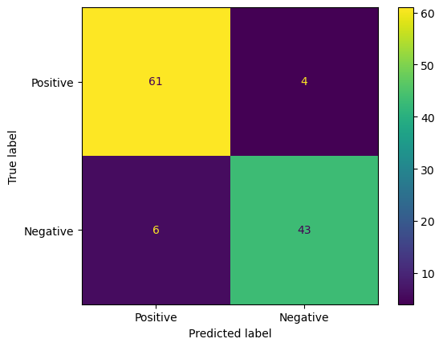

# Data Analysis Project on the Characteristics of Breast Cancer Tumors

## Overview
This project analyzes the **Breast Cancer Wisconsin (Diagnostic) Dataset** to explore the characteristics of tumors and build a machine learning model that determines whether a tumor is **malignant** or **benign** based on its features.

The project follows the steps of the Data Science process:
1. Retrieve Data  
2. Data Cleaning and Transformation  
3. Exploratory Data Analysis (EDA)  
4. Model Building  

## Dataset
The dataset used for this project is the *Breast Cancer Wisconsin (Diagnostic) Dataset* obtained from **Kaggle**.  

Each row contains the characteristics of a tumor, including whether it is **malignant (M)** or **benign (B)**.

## Project Structure
```
BREAST-CANCER_DS/
│
├── data/
│ └── breast-cancer.csv # Dataset
│
├── notebooks/
│ └── breast-cancer.ipynb # Main analysis notebook
│
├── requirements.txt # Required Python libraries
└── README.md # Project documentation
```

## Methods

### 1. Loading Data
- Download data from Kaggle  
- Load data into VS Code  

### 2. Data Cleaning and Transformation 
- Fix potential errors  
- Prepare data for modeling by reshaping variables and creating new features  

### 3. Exploratory Data Analysis (EDA) 
- Use graphical techniques to visualize the data and identify trends  

### 4. Analyzing Feature Correlation
- Calculate correlations between characteristics and the target variable (`diagnosis`)  

### 5. Dropping Irrelevant and Missing Values
- Remove columns with low correlation to the target variable  
- Provide the best input for the machine learning model  

### 6. Dividing the Dataset 
- Split the dataset into training and testing sets  

### 7. Normalizing the Input Features
- Scale the input variables so they are treated equally by the model  

### 8. Creating and Training the Machine Learning Model 
- Create and train the model to predict whether a tumor is malignant or benign  

### 9. Testing the Machine Learning Model
- Predict tumor types on the test data  
- Calculate the accuracy score of the model  

### 10. Creating a Confusion Matrix
- Visualize the model’s predicted values versus the actual values  

## Results

### Accuracy Score:
91%  

### Confusion Matrix 


### Interpretation:  
- **True Positive (TP):** 61 malignant tumors correctly classified as malignant  
- **True Negative (TN):** 43 benign tumors correctly classified as benign  
- **False Positive (FP):** 6 benign tumors incorrectly predicted as malignant  
- **False Negative (FN):** 4 malignant tumors incorrectly predicted as benign  

## Requirements
To install the required Python libraries, run:  

```
pip install -r requirements.txt
```

## How to Run

1. Clone this repository:
```
git clone https://github.com/mahnooraltaf123/breast-cancer-data-analysis.git
```

2. Navigate to the project folder:
```
cd breast-cancer_ds
```

3. Open the Jupyter notebook:
```
jupyter notebook notebooks/breast-cancer.ipynb
```

4. Click ***Run All*** to execute the code.

## Author

Name: Mahnoor Altaf
